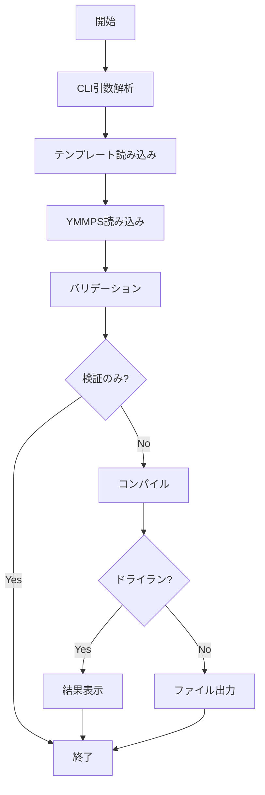
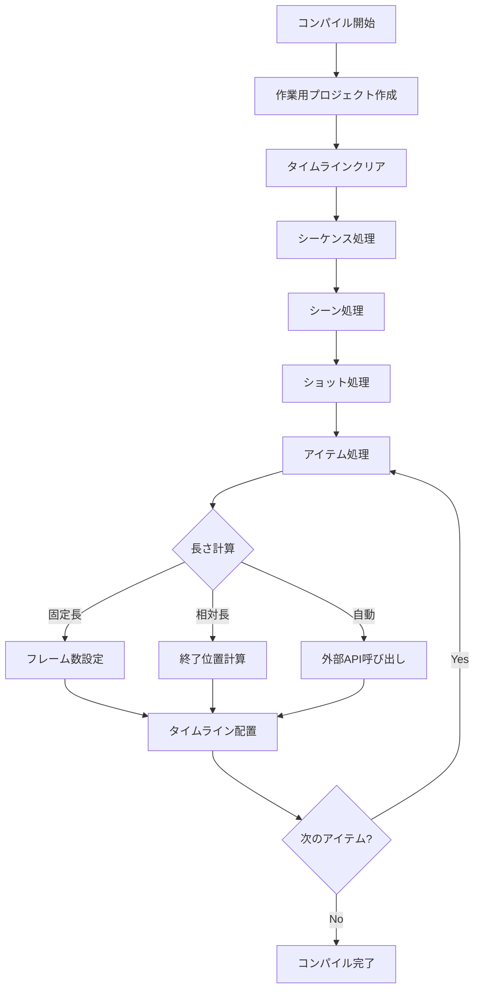

# YMMP Scenario Converter 設計書

## 1. 概要

本ドキュメントは、YMMP Scenario Converter の設計を記述する。要件定義書に基づき、システムのアーキテクチャ、コンポーネント構成、データモデル、処理フローを定義する。

## 2. アーキテクチャ概要

### 2.1 システム構成

```
┌─────────────┐     ┌──────────────┐     ┌─────────────┐
│  CLI層      │ --> │  ビジネス層   │ --> │  データ層    │
│             │     │              │     │             │
│ - CLIパーサー │     │ - Converter  │     │ - YMMPパーサー│
│ - バリデーター│     │ - Compiler   │     │ - YMMPSパーサー│
└─────────────┘     │ - Calculator │     │ - ファイルI/O │
                    └──────────────┘     └─────────────┘
```

### 2.2 主要コンポーネント

1. **CLI層**: コマンドライン引数の解析と実行制御
2. **ビジネス層**: 変換ロジックの中核
3. **データ層**: ファイルの読み書きとデータモデルの管理

## 3. データモデル

### 3.1 YMMPS構造体

```go
// YMMPSDocument - YMMPSファイル全体を表現
type YMMPSDocument struct {
    YMMPSVersion string       `yaml:"YMMPSVersion"`
    Sequences    []Sequence   `yaml:"Sequences"`
}

// Sequence - 複数のSceneを含む
type Sequence struct {
    ID     string  `yaml:"ID,omitempty"`
    Scenes []Scene `yaml:"Scenes"`
}

// Scene - 複数のShotを含む
type Scene struct {
    ID    string `yaml:"ID,omitempty"`
    Shots []Shot `yaml:"Shots"`
}

// Shot - 複数のItemを同時に開始
type Shot struct {
    ID    string     `yaml:"ID,omitempty"`
    Items []ItemSpec `yaml:",inline"`
}

// ItemSpec - YMMPSでのアイテム仕様
type ItemSpec struct {
    Template   string                 `yaml:"_Template"`
    Length     string                 `yaml:"Length"`
    Properties map[string]interface{} `yaml:",inline"`
}

// Length型の定義
type LengthType string

const (
    LengthTypeNumeric      LengthType = "numeric"      // 数値（フレーム数）
    LengthTypeUntilSeqEnd  LengthType = "until_seq"    // シーケンス終了まで
    LengthTypeUntilSceneEnd LengthType = "until_scene" // シーン終了まで
    LengthTypeUntilShotEnd  LengthType = "until_shot"  // ショット終了まで
    LengthTypeUntilIDEnd    LengthType = "until_id"    // 指定ID要素の終了まで
    LengthTypeAutoVoice     LengthType = "auto_voice"  // 音声長自動計算
    LengthTypeAutoVideo     LengthType = "auto_video"  // 動画長自動計算
)

// ParsedLength - パース済みのLength情報
type ParsedLength struct {
    Type      LengthType
    Value     int    // numeric時のフレーム数
    TargetID  string // until_id時の対象ID
    TargetType string // until_id時の対象タイプ（SEQUENCE/SCENE/SHOT）
}
```

### 3.2 YMMP構造体（既存フォーマット）

```go
// YMMPProject - YMMPファイル全体
type YMMPProject struct {
    FilePath              string     `json:"FilePath"`
    SelectedTimelineIndex int        `json:"SelectedTimelineIndex"`
    Timelines             []Timeline `json:"Timelines"`
    Characters            []Character `json:"Characters"`
    CollapsedGroups       []string   `json:"CollapsedGroups"`
}

// Timeline - タイムライン情報
type Timeline struct {
    ID           string        `json:"ID"`
    Name         string        `json:"Name"`
    VideoInfo    VideoInfo     `json:"VideoInfo"`
    Items        []interface{} `json:"Items"` // 各種Item型のインターフェース
    CurrentFrame int           `json:"CurrentFrame"`
    Length       int           `json:"Length"`
    MaxLayer     int           `json:"MaxLayer"`
}

// VideoInfo - ビデオ設定
type VideoInfo struct {
    FPS    int `json:"FPS"`
    Hz     int `json:"Hz"`
    Width  int `json:"Width"`
    Height int `json:"Height"`
}

// BaseItem - 全てのアイテムタイプの共通フィールド
type BaseItem struct {
    Frame    int    `json:"Frame"`
    Layer    int    `json:"Layer"`
    Length   int    `json:"Length"`
    Remark   string `json:"Remark"`
    IsLocked bool   `json:"IsLocked"`
    IsHidden bool   `json:"IsHidden"`
}

// VoiceItem - 音声アイテム
type VoiceItem struct {
    Type          string `json:"$type"`
    BaseItem
    CharacterName string `json:"CharacterName"`
    Serif         string `json:"Serif"`
    Hatsuon       string `json:"Hatsuon"`
    // ... 他のフィールド
}

// VideoItem - 動画アイテム
type VideoItem struct {
    Type     string `json:"$type"`
    BaseItem
    FilePath string `json:"FilePath"`
    // ... 他のフィールド
}

// TachieItem - 立ち絵アイテム
type TachieItem struct {
    Type          string `json:"$type"`
    BaseItem
    CharacterName string `json:"CharacterName"`
    // ... 他のフィールド
}
```

## 4. 主要コンポーネントの詳細設計

### 4.1 CLI層

```go
// CLIOptions - コマンドラインオプション
type CLIOptions struct {
    TemplateFile  string
    YMMPSFile     string
    BasePath      string
    ValidateOnly  bool
    Verbose       bool
    DryRun        bool
}

// CLIParser - コマンドライン引数を解析
type CLIParser interface {
    Parse(args []string) (*CLIOptions, error)
    ShowHelp()
}
```

### 4.2 Converter（メインコンバーター）

```go
// Converter - 変換処理の中核
type Converter struct {
    templateLoader TemplateLoader
    ymmpsParser    YMMPSParser
    compiler       Compiler
    validator      Validator
    writer         YMMPWriter
}

// Convert - 変換処理のエントリーポイント
func (c *Converter) Convert(options *CLIOptions) error {
    // 1. テンプレートファイルを読み込む
    template, err := c.templateLoader.Load(options.TemplateFile)
    
    // 2. YMMPSファイルを読み込む
    ymmps, err := c.ymmpsParser.Parse(options.YMMPSFile)
    
    // 3. バリデーション
    if err := c.validator.Validate(template, ymmps); err != nil {
        return err
    }
    
    if options.ValidateOnly {
        return nil
    }
    
    // 4. コンパイル（YMMPSからYMMPへの変換）
    result, err := c.compiler.Compile(template, ymmps, options)
    
    if options.DryRun {
        c.showDryRunResult(result)
        return nil
    }
    
    // 5. 出力
    return c.writer.Write(result, c.generateOutputPath(options))
}
```

### 4.3 Compiler（コンパイラー）

```go
// Compiler - YMMPSをYMMPに変換
type Compiler struct {
    calculator     TimelineCalculator
    pathResolver   PathResolver
    lengthResolver LengthResolver
    templateMerger TemplateMerger
}

// Compile - コンパイル処理
func (c *Compiler) Compile(template *YMMPProject, ymmps *YMMPSDocument, options *CLIOptions) (*YMMPProject, error) {
    // 1. 作業用のプロジェクトを作成
    project := c.cloneTemplate(template)
    
    // 2. タイムラインをクリア
    timeline := &project.Timelines[0]
    timeline.Items = []interface{}{}
    
    // 3. コンパイルコンテキストを作成
    ctx := &CompileContext{
        Template:  template,
        Project:   project,
        Timeline:  timeline,
        BasePath:  options.BasePath,
        FrameRate: timeline.VideoInfo.FPS,
    }
    
    // 4. 階層構造を処理
    currentFrame := 0
    for _, sequence := range ymmps.Sequences {
        endFrame, err := c.compileSequence(ctx, sequence, currentFrame)
        if err != nil {
            return nil, err
        }
        currentFrame = endFrame
    }
    
    // 5. タイムライン長を更新
    timeline.Length = currentFrame
    
    // 6. ファイルパスを更新
    project.FilePath = c.generateOutputPath(options)
    
    return project, nil
}

// compileSequence - シーケンスをコンパイル
func (c *Compiler) compileSequence(ctx *CompileContext, seq Sequence, startFrame int) (int, error) {
    ctx.CurrentSequence = &seq
    currentFrame := startFrame
    
    for _, scene := range seq.Scenes {
        endFrame, err := c.compileScene(ctx, scene, currentFrame)
        if err != nil {
            return 0, err
        }
        currentFrame = endFrame
    }
    
    // シーケンス終了フレームを記録
    ctx.RegisterEndFrame("sequence", seq.ID, currentFrame)
    return currentFrame, nil
}
```

### 4.4 TimelineCalculator（タイムライン計算）

```go
// TimelineCalculator - タイムライン上の位置と長さを計算
type TimelineCalculator struct {
    voiceLengthCalculator VoiceLengthCalculator
    videoLengthCalculator VideoLengthCalculator
}

// CalculateItemLength - アイテムの長さを計算
func (tc *TimelineCalculator) CalculateItemLength(
    item *ItemSpec, 
    ctx *CompileContext,
    templateItem interface{},
) (int, error) {
    parsed := tc.parseLength(item.Length)
    
    switch parsed.Type {
    case LengthTypeNumeric:
        return parsed.Value, nil
        
    case LengthTypeUntilSeqEnd:
        return tc.calculateUntilEnd(ctx, "sequence", ctx.CurrentSequence.ID)
        
    case LengthTypeUntilSceneEnd:
        return tc.calculateUntilEnd(ctx, "scene", ctx.CurrentScene.ID)
        
    case LengthTypeUntilShotEnd:
        return tc.calculateUntilEnd(ctx, "shot", ctx.CurrentShot.ID)
        
    case LengthTypeUntilIDEnd:
        return tc.calculateUntilEnd(ctx, parsed.TargetType, parsed.TargetID)
        
    case LengthTypeAutoVoice:
        return tc.voiceLengthCalculator.Calculate(item, templateItem)
        
    case LengthTypeAutoVideo:
        return tc.videoLengthCalculator.Calculate(item, templateItem)
        
    default:
        return 0, fmt.Errorf("unknown length type: %s", item.Length)
    }
}
```

### 4.5 Validator（バリデーター）

```go
// Validator - 入力データの検証
type Validator struct {
    schemaValidator SchemaValidator
    refValidator    ReferenceValidator
}

// Validate - 包括的なバリデーション
func (v *Validator) Validate(template *YMMPProject, ymmps *YMMPSDocument) error {
    // 1. YMMPSバージョンチェック
    if ymmps.YMMPSVersion != "1" {
        return fmt.Errorf("unsupported YMMPS version: %s", ymmps.YMMPSVersion)
    }
    
    // 2. スキーマバリデーション
    if err := v.schemaValidator.ValidateYMMPS(ymmps); err != nil {
        return err
    }
    
    // 3. テンプレート参照の検証
    if err := v.validateTemplateReferences(template, ymmps); err != nil {
        return err
    }
    
    // 4. ID参照の検証
    if err := v.refValidator.ValidateReferences(ymmps); err != nil {
        return err
    }
    
    return nil
}
```

### 4.6 外部依存サービス

```go
// VoiceLengthCalculator - VOICEVOX APIを使用して音声長を計算
type VoiceLengthCalculator interface {
    Calculate(item *ItemSpec, templateItem interface{}) (int, error)
}

// VideoLengthCalculator - ffprobeを使用して動画長を計算
type VideoLengthCalculator interface {
    Calculate(item *ItemSpec, templateItem interface{}) (int, error)
}

// PathResolver - 相対パスを絶対パスに変換
type PathResolver interface {
    Resolve(relativePath string, basePath string) string
}
```

## 5. 処理フロー

### 5.1 メイン処理フロー



### 5.2 コンパイル処理フロー



## 6. エラーハンドリング

### 6.1 エラー分類

1. **入力エラー**: ファイルが見つからない、読み込み失敗
2. **検証エラー**: スキーマ違反、参照エラー
3. **処理エラー**: 長さ計算失敗、API呼び出しエラー
4. **出力エラー**: ファイル書き込み失敗

### 6.2 エラーメッセージ設計

```go
// ValidationError - 検証エラーの詳細情報を含む
type ValidationError struct {
    Type     string // "schema", "reference", "template"
    Location string // "sequences[0].scenes[1].shots[0]"
    Field    string // "Length"
    Message  string // 具体的なエラー内容
}

func (e ValidationError) Error() string {
    return fmt.Sprintf("Validation error at %s.%s: %s", e.Location, e.Field, e.Message)
}
```

## 7. 拡張性の考慮

### 7.1 新しいItemタイプの追加

```go
// ItemProcessor - 各Itemタイプの処理インターフェース
type ItemProcessor interface {
    CanProcess(templateItem interface{}) bool
    Process(spec *ItemSpec, templateItem interface{}, ctx *CompileContext) (interface{}, error)
}

// ItemProcessorRegistry - プロセッサーの登録管理
type ItemProcessorRegistry struct {
    processors []ItemProcessor
}

func (r *ItemProcessorRegistry) Register(processor ItemProcessor) {
    r.processors = append(r.processors, processor)
}
```

### 7.2 新しい長さ計算方法の追加

```go
// LengthCalculator - 長さ計算のインターフェース
type LengthCalculator interface {
    CanCalculate(lengthType string) bool
    Calculate(item *ItemSpec, ctx *CompileContext) (int, error)
}

// LengthCalculatorRegistry - 計算方法の登録管理
type LengthCalculatorRegistry struct {
    calculators map[string]LengthCalculator
}
```

## 8. パフォーマンス考慮事項

1. **大規模プロジェクト対応**
   - ストリーミング処理は不要（メモリに全て読み込む）
   - 必要に応じてゴルーチンで並列処理

2. **キャッシュ戦略**
   - VOICEVOX API呼び出し結果のキャッシュ
   - ffprobe結果のキャッシュ

3. **メモリ使用量**
   - テンプレートのディープコピーを最小限に
   - 不要なデータの早期解放

## 9. テスト戦略

### 9.1 単体テスト対象

- 各コンポーネントの個別機能
- Length解析ロジック
- パス解決ロジック
- バリデーションルール

### 9.2 統合テスト対象

- エンドツーエンドの変換処理
- 各種エラーケース
- 大規模プロジェクトのパフォーマンス

### 9.3 モックとスタブ

- VOICEVOX APIのモック
- ffprobeコマンドのスタブ
- ファイルI/Oのモック